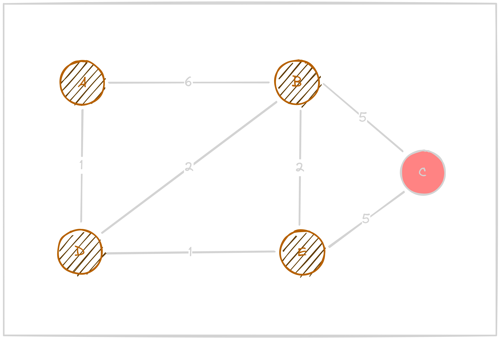

# Gráfok

## Gráfreprezentációk
### Éllista
### Szomszédsági mátrix
### Szomszédsági lista


<br><br>
## Bejárások
Egy-egy bejárásnál azt vizsgáljuk, hogy a gráfunkban egy megadott csúcstól képesek vagyunk-e eljutni egy másik megadott csúcsba. Ezt két féle képpen vizsgálhatjuk, ***szélességi bejárással** (Breadth-first search - BFS)* vagy ***mélységi bejárással** (Depth-first search - DFS)*.
<br><br>


A ***szélességi bejárás*** olyan, mint a pénztárnál álló sor.

Tegyük fel, hogy amikor egy vevő fizet, akkor behív még *x* vásárlót *('x' lehet 0 db)*, hogy álljon sorba. Ebben a helyzetben az újonnan beérkező vásárlók a sor végére állnak be. Hozzájuk azután jutunk el, hogy a már sorban álló vevőket lefizettetük. Magyarán mindig

**a *legrégebbi teendőmet* vizsgálom meg először, a vizsgálatnál talált új elemek a *teendőim listájának végére* kerülnek.**


<br><br>
A ***mélységi bejárás*** ezzel szemben olyan, mintha egy labirintusból szeretnénk kijutni.

Indulás után, mikor egy elágazáshoz érünk, akkor az egyik úton továbbhaladunk. Ezt addig ismételgetjük, amíg zsákutcába nem érünk. Amikor ez megtörténik, akkor visszamegyünk a legutolsó elágazásig, ahol pedig a másik úton haladunk tovább. Ezt, a "végigmegyünk a zsákutcáig, vissza az utolsó elágazásig" folyamatot ismételgetjük, amíg ki nem jutunk a labirintusból. Magyarán mindig

**a *legfrissebb teendőmet* vizsgálom meg először, a vizsgálatnál talált új elemek a *teendőim listájának elejére* kerülnek.**


<br><br>
### Példa

Vegyük az alábbi irányított gráfot példaként:


**Feladat: eljutni a ```0```-ás csúcsból a ```7```-es csúcsba**

<details>
<summary><b>Levezetés:</b></summary>
<br>

| # | Szélességi bejárás (BFS) | teendők<br>sorrendje | Mélységi bejárás (DFS) | teendők<br>sorrendje |
| :---: | :---: | :---: | :---: | :---: |
| **0.**|  | 0 |  | 0 |
| **1.**|  | 1<br>2<br>3<br>5<br>6 |  | 1<br>2<br>3<br>5<br>6 |
| **2.**|  | 2<br>3<br>5<br>6 |  | 2<br>3<br>5<br>6 |
| **3.**|  | 3<br>5<br>6<br>4 |  | 4<br>3<br>5<br>6 |
| **4.**|  | 5<br>6<br>4<br>7 |  | 7<br>3<br>5<br>6 |
| **5.**|  | 6<br>4<br>7 |  | **M<br>E<br>G<br>V<br>A<br>N** |
| **6.**|  | 4<br>7 |  | |
| **7.**|  | 7 |  | |
| **8.**|  | **M<br>E<br>G<br>V<br>A<br>N** |  | |
</details>

Ebben a példában a mélységi bejárás bizonyult gyorsabbnak, ám ha mondjuk a 7-es csúcs helyett pl. a 3-as csúcs elérhetőségét vizsgáltuk volna, akkor a szélességi bejárás lett volna gyorsabb. *(Az 1-es csúcsból az 5-ös csúcsba eljutni pedig nem lehetséges.)* Felmerül ekkor a kérdés:

<br><br>
### Mikor melyiket használjuk?

Néha a szélességi jobb, néha pedig a mélységi.

**Hogy melyik a jobb az adott helyzetben, azt pontosan nem tudhatjuk** (hiszen akkor tudnánk a megoldást, nem lenne szükség bejárni a gráfot), ám ha ismerjük az adatszerkezetünk körülbelüli felépítését, akkor ki tudjuk választani, hogy *valószínűleg* melyik lesz gyorsabb.

**Szélességi bejárás:** ha a keresett érték közel van a kiindulóponthoz

**Mélységi bejárás:** ha a keresett érték aránylag messzebb van a kiindulóponttól


<br><br>
### Pszeudokód

Programozás során ez egy különbséget jelent: a tennivalókat **Sorban** (**```Queue```**) vagy **Veremben** (**```Stack```**) tároljuk-e. Az előbbit a szélességi bejárásnál, míg az utóbbit a mélységinél használjuk.

<details>
<summary><b>Szélességi bejárás - BFS</b></summary>

```
Függvény El_lehet_e_jutni_szelessegivel(graf: Graf, innen: Egész, ide: Egész): Logikai
    Lokális:
        fehér: Egész
        szürke: Egész
        fekete: Egész
        tennivalók: Sor
        szín: Tömb[Egész]
        tennivaló: Egész

    fehér := 0
    szürke := 1
    fekete := 2

    szín := új Tömb[Egész](graf.Csúcsszama)

    tennivalók := új Sor
    tennivalók.Beletesz(innen)
    szín[innen] := szürke

    El_lehet_e_jutni := Hamis

    Ciklus amíg nem El_lehet_e_jutni és nem tennivalók.Üres():
        tennivaló := tennivalók.Kivesz()

        Ha feldolgozando = ide:
            El_lehet_e_jutni := Igaz
        Különben:
            szín[feldolgozando] := fekete

            Iteráció szomszéd eleme graf.szomszédai[tennivaló]:
                Ha szín[szomszéd] = fehér:
                    tennivalók.Beletesz(szomszéd)
                    szín[szomszéd] := szürke
                Elágazás vége
            Iteráció vége
        Elágazás vége
    Ciklus vége
Függvény vége
```
</details>

[C#](../_assets/bfs.cs)


<details>
<summary><b>Mélységi bejárás - DFS</b></summary>

```
Függvény El_lehet_e_jutni_melysegivel(graf: Graf, innen: Egész, ide: Egész): Logikai
    Lokális:
        fehér: Egész
        szürke: Egész
        fekete: Egész
        tennivalók: Verem
        szín: Tömb[Egész]
        tennivaló: Egész

    fehér := 0
    szürke := 1
    fekete := 2

    szín := új Tömb[Egész](graf.Csúcsszama)

    tennivalók := új Verem
    tennivalók.Beletesz(innen)
    szín[innen] := szürke

    El_lehet_e_jutni := Hamis

    Ciklus amíg nem El_lehet_e_jutni és nem tennivalók.Üres():
        tennivaló := tennivalók.Kivesz()

        Ha feldolgozando = ide:
            El_lehet_e_jutni := Igaz
        Különben:
            szín[feldolgozando] := fekete

            Iteráció szomszéd eleme graf.szomszédai[tennivaló]:
                Ha szín[szomszéd] = fehér:
                    tennivalók.Beletesz(szomszéd)
                    szín[szomszéd] := szürke
                Elágazás vége
            Iteráció vége
        Elágazás vége
    Ciklus vége
Függvény vége
```
</details>

[C#](../_assets/dfs.cs)


## Legrövidebb út

## Dijkstra-algoritmus

A **Djikstra-algoritmus** egy (gráf bejárással kombinált) mohó algoritmus a legrövidebb út megállapítására egy adott csúcsból. Súlyozott gráfoknál használjunk.


> #### Wikipédia percek:
>
> A Dijkstra-algoritmust Edsger Wybe Dijkstra holland informatikus fejlesztette ki. Az "eredeti" algoritmus két megadott csúcs között kereste meg a legrövidebb utat, ma már viszont az a verzió az elterjedtebb, amiben az algoritmus *egy kijelölt csúcstól* indulva, ahhoz képest adja meg a *legrövidebb utat az összes többi csúcsba*.

Maga az algoritmus **nem azt mondja meg**, hogy *'A'-ból 'B'-be* melyik a leggyorsabb út, hanem, hogy ***'A'-ból bárhova*** melyik a leggyorsabb út. A csúcsok vizsgálatának sorrendje az egyes utak súlyozásától függ. Tehát, mindig a leggyorsabb úton megyünk végig elsőnek.

Ez az algoritmus a gráf teljes bejárását igényli, hiszen sosem tudjuk biztosra, hogy egy, még nem vizsgált út nem-e lesz gyorsabb, mint amit leggyorsabb útként tárolunk.

#### Hogyan tároljuk az egyes csúcsokba való eljutást?
Minden csúcsnál két információt tárolunk, azt hogy ```mennyibe került idejutni``` és hogy ```kitől jutottam el ide```. Ezt a tárolt információt akkor vizsgáljuk fölül, ha az adott csúcsba egy új utat járva próbálunk eljutni.

Ha egy csúcsba több úton is eljuthatunk, akkor meg kell vizsgálnunk, hogy az előző út, amin eljutottunk oda, az gyorsabb-e. Ha igen, akkor nem csinálunk semmit, ha nem, akkor felülírjuk az előző értéket.

<a href="https://www.youtube.com/watch?v=pVfj6mxhdMw" target="_blank"><i>Angol nyelvű magyarázó videó</i></a>

**FONTOS:** Negatív számokkal nem működik.


<br><br>
### Példa

Vegyük az alábbi súlyozott irányítatlan gráfot:


**Feladat: ```A``` és ```B``` csúcs közötti legrövidebb út megtalálása**

<details>
<summary><b>Levezetés:</b></summary>
<br>

| # | Dijkstra-algoritmus | legrövidebb<br>út |  látogatott<br>csúcsok | még nem<br>látogatott<br>csúcsok |
| :--: | :--: | :--: |  :--: | :--: |
| 0. |  |  | [] |  [A,B,C,D,E] |
| 1. |  |  | [] |  [A,B,C,D,E] |
| 2. |  |  | [A] |  [B,C,D,E] |
| 3. |  |  | [A,D] |  [B,C,E] |
| 4. |  |  | [A,D,E] |  [B,C] |
| 5. |  |  | [A,D,E,B] |  [C] |
| 5. |  |  | [A,D,E,B,C] |  [] |
</details>

A tárolt adatok táblázatából egyből láthatjuk, hogy ```B``` csúcsba 3 a legrövidebb út, amit ```D```csúcson keresztül érhetünk el.

Ha magát az útvonalat szeretnénk megkapni, akkor szimplán elindulunk visszafelé. Ha az alábbi példából indulunk ki, akkor kiindulunk ```B```-ből, ott látjuk, hogy a ```D``` csúcsból értük el legrövidebben, majd ugyanezt megismételjük ```D```-nél (és így folytatódna, ha nagyobb lenne a gráf), mire eljutunk ```A```-hoz.

<br><br>
### Pszeudokód

Az adatok tárolásához ***kupacokat** (priority queue)* fogunk  használni, mivel mindig a lerövidebb utat akarjuk először megvizsgálni.

```
Függvény Dijkstra_algoritmus (graf: Gráf, eredet: Egész):
    Lokális:
        valami: Egész


    dist[source] ← 0

    create vertex priority queue Q


    Ciklus ...:
    Ciklus vége

    for each vertex v in Graph.Vertices:
        if v ≠ source
            dist[v] ← INFINITY
            prev[v] ← UNDEFINED

        Q.add_with_priority(v, dist[v])


    while Q is not empty:
        u ← Q.extract_min()
        for each neighbor v of u:
            alt ← dist[u] + Graph.Edges(u, v)
            if alt < dist[v]:
                dist[v] ← alt
                prev[v] ← u
                Q.decrease_priority(v, alt)
    return dist, prev


    Függvény El_lehet_e_jutni_szelessegivel(graf: Graf, innen: Egész, ide: Egész): Logikai
    Lokális:
        fehér: Egész
        szürke: Egész
        fekete: Egész
        tennivalók: Sor
        szín: Tömb[Egész]
        tennivaló: Egész

    fehér := 0
    szürke := 1
    fekete := 2

    szín := új Tömb[Egész](graf.Csúcsszama)

    tennivalók := új Sor
    tennivalók.Beletesz(innen)
    szín[innen] := szürke

    El_lehet_e_jutni := Hamis

    Ciklus amíg nem El_lehet_e_jutni és nem tennivalók.Üres():
        tennivaló := tennivalók.Kivesz()

        Ha feldolgozando = ide:
            El_lehet_e_jutni := Igaz
        Különben:
            szín[feldolgozando] := fekete

            Iteráció szomszéd eleme graf.szomszédai[tennivaló]:
                Ha szín[szomszéd] = fehér:
                    tennivalók.Beletesz(szomszéd)
                    szín[szomszéd] := szürke
                Elágazás vége
            Iteráció vége
        Elágazás vége
    Ciklus vége
Függvény vége
```
C#

## Floyd–Warshall-algoritmus
